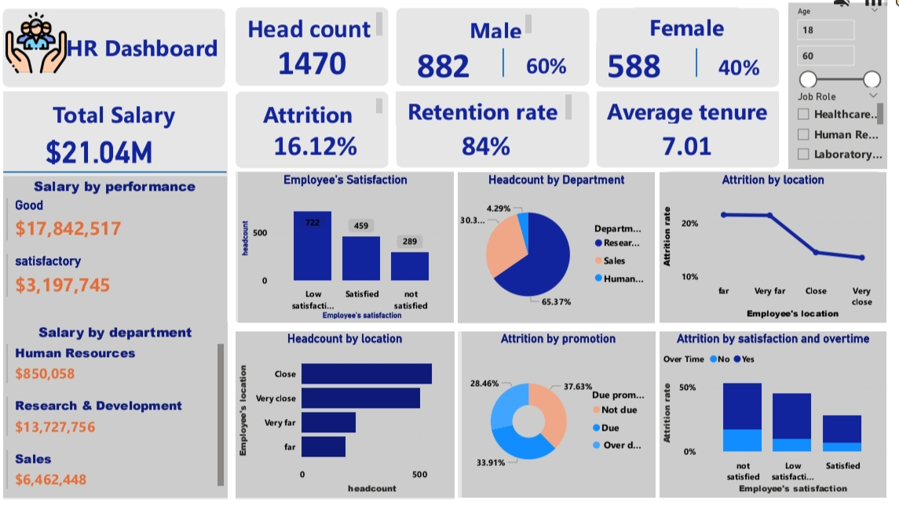

# HR Analytics Dashboard: Understanding & Reducing Employee Attrition
## Project Overview 
This project analyzes workforce data for a 1,470-employee organization using Power BI. The goal is to move beyond a single attrition number and understand why employees are leaving  by examining satisfaction, overtime, commute distance, promotion status, department, and compensation together. The result is an interactive HR dashboard that lets stakeholders filter by age and job role, and drill into the drivers of attrition at a glance.

## Business Challenge 
The company is losing employees at a rate of 16.12%, against an 84% retention rate. Leadership does not have a clear, data-backed view of:

▪️ Which employee segments are most at risk of leaving

▪️ Whether attrition is being driven by pay, satisfaction, commute, or promotion practices

▪️ Where HR and management should focus limited retention resources
Without this visibility, retention efforts risk being reactive and unfocused, and the cost of continued turnover (recruitment, onboarding, lost productivity) keeps compounding.

## Business Questions 
This dashboard was built to answer the following business questions to give insights that will be useful to in decision-making based on the business challenges faced:
1. Without this visibility, retention efforts risk being reactive and unfocused, and the cost of continued turnover (recruitment, onboarding, low productivity) keeps compounding.
2. How is total salary distributed across departments and performance level?
3. How satisfied are employees with their jobs, and how does that relate to attrition?
4. Does commute distance (employee location) affect attrition?
5. Does overtime work combined with low satisfaction increase attrition risk?
6. Does promotion status (due, not due, overdue) influence attrition?
7. Which department carries the largest share of headcount and payroll?

## Action: Data Preparation and Processing 
#### Data Preparation 
Raw HR records were loaded into Power BI and cleaned/shaped using Power Query (handling data types, removing duplicates/blank fields, and structuring columns such as satisfaction level, overtime status, promotion status, and employee location into analysis-ready categories).
#### Data Modelling 
Relationships were built between employee attributes (department, job role, performance, satisfaction, tenure) to support cross-filtering across visuals.
#### Measures
DAX measures were created for key metrics, including Attrition Rate, Retention Rate, Total Salary, Average Tenure, and Headcount, so figures could be sliced dynamically by department, location, promotion status, and satisfaction.
#### Data Visualization 
The final model was visualized in Power BI Desktop with slicers for Age and Job Role, enabling interactive exploration.

## Key Insights
#### Headcount & Pay
1,470 employees in total (882 male / 60%, 588 female / 40%); total salary paid is $21.04M.
#### Department Weight
Research & Development holds the largest share of both headcount (65.37%) and salary spend ($13.7M), followed by Sales (30.3% headcount, $6.46M) and HR (4.29% headcount, $850K).
#### Performance & Pay
Employees rated "Good" performance receive the bulk of salary ($17.84M) versus "Satisfactory" performers ($3.2M).
#### Salary Satisfaction 
Satisfaction is a bigger problem than it looks: 722 employees report low satisfaction, 459 are satisfied, and 289 are not satisfied — meaning the majority of the workforce is not fully satisfied.
#### Distance drives attrition
Employees living far or very far from work show a noticeably higher attrition rate than those living close or very close.
#### Overtime + Satisfaction compound risk
Employees who are dissatisfied and also work overtime show the highest attrition rates of any group.
#### Promotion isn't the main driver of attrition 
Employees not due for promotion actually show the highest attrition rate (33.91%), ahead of those due for promotion (28.46%) — suggesting promotion timing alone doesn't explain attrition.
#### Key takeaway 
Job dissatisfaction and not promotion is the primary driver of attrition, and it's amplified by long commutes and overtime.

## Dashboard 
The dashboard is a single-page Power BI report combining:
▪️ KPI cards (Headcount, Gender split, Total Salary, Attrition, Retention, Average Tenure)

▪️ Salary breakdowns by performance and department

▪️ Employee satisfaction distribution 

▪️ Headcount by department (pie) and by location (bar)

▪️ Attrition by location, by promotion status, and by satisfaction/overtime combined

▪️ Interactive slicers for Age range and Job Role

## Recommendations
1. Prioritize satisfaction, not just promotion policy by investigating  root root causes of low satisfaction (workload, management, growth opportunity) since it's the leading attrition signal.
2. Address overtime for at-risk staff — reduce or better compensate overtime for employees already showing low satisfaction, since this combination has the highest attrition rate.
3. Support employees with long commutes — consider hybrid/remote options, transport support, or relocation assistance for staff living far/very far from the workplace.
4. Review R&D retention specifically : since R&D carries the largest headcount and payroll exposure, even a small percentage improvement in retention there yields outsized savings.
5. Though promotion is not the top driver of Attrition, it should be re-evaluated to ensure promotion timelines are transparent and fair, since perceived stagnation still contributes to attrition.
6. Build a continuous listening mechanism by conducting regular pulse surveys to catch dissatisfaction before it turns into attrition.

## Conclusion 
This analysis shows that employee attrition at the company is driven primarily by job dissatisfaction, intensified by long commutes and overtime, not by promotion timing as might be assumed. With 1,470 employees, a 16.12% attrition rate, and $21.04M in annual salary exposure, targeted retention efforts (starting with satisfaction and workload) offer the clearest path to protecting both people and payroll investment. The Power BI dashboard gives HR and leadership a reusable, interactive tool to monitor these drivers going forward.

## Tools Used
Power Query — data cleaning and transformation

DAX (Data Analysis Expressions) — custom measures for attrition rate, retention rate, salary, and tenure

Power BI Desktop — data modeling, visualization, and interactive dashboard design
